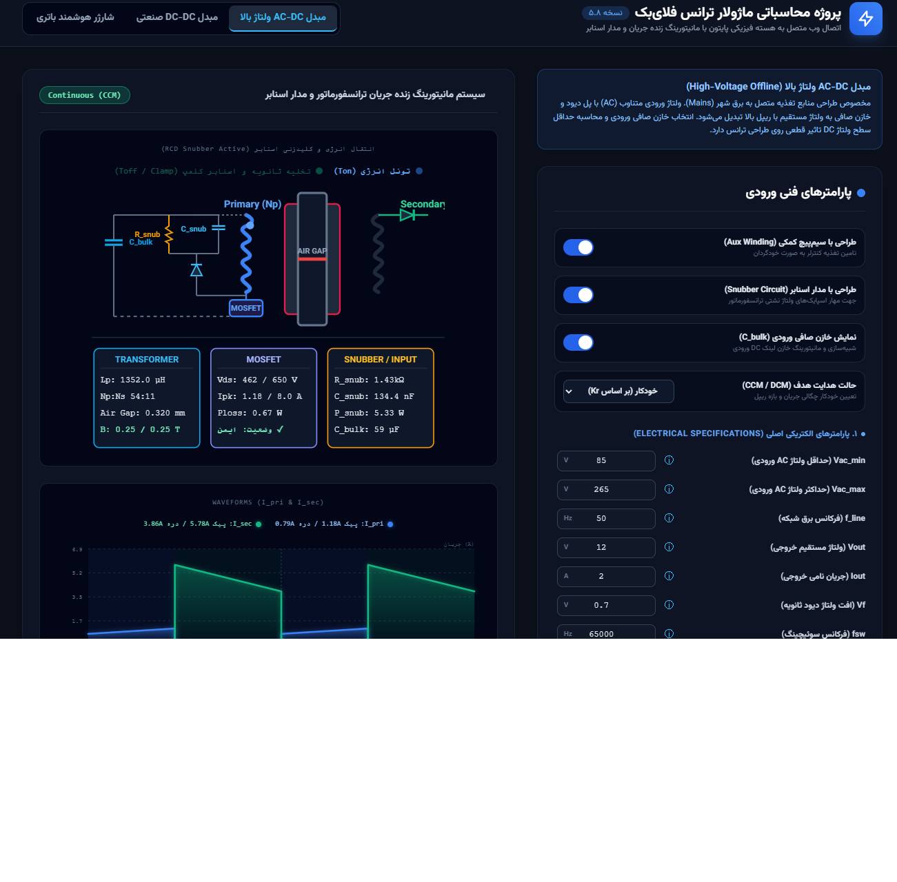
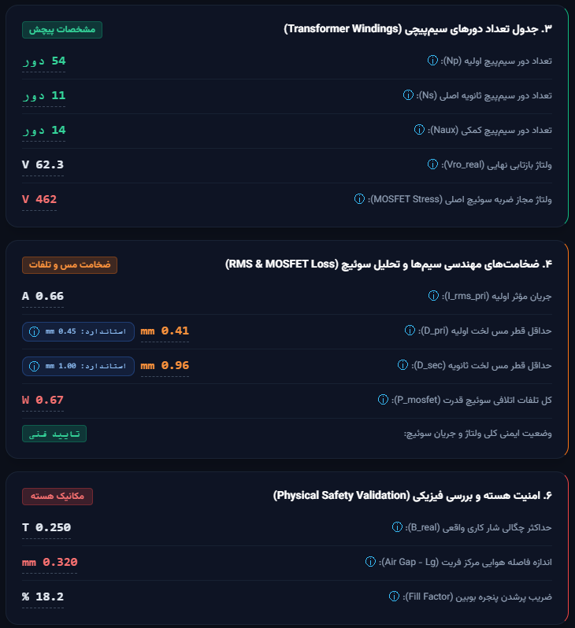
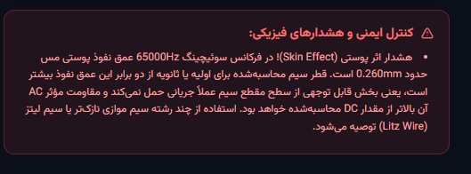

# پروژه محاسباتی ماژولار ترانس فلای‌بک (Flyback Transformer Design Suite)

ابزار وب مهندسی برای طراحی فیزیکی و الکتریکی ترانسفورماتورهای فلای‌بک آفلاین، با موتور محاسباتی مستقل در پایتون و رابط کاربری تعاملی مبتنی بر وب.

---

## ⚙️ ساختار توپولوژی‌های پشتیبانی‌شده

برنامه سه حالت طراحی مستقل را با فرم‌های ورودی، معادلات و منطق فیزیکی اختصاصی پشتیبانی می‌کند:

| تب | کاربرد | ورودی ولتاژ |
|---|---|---|
| **AC-DC ولتاژ بالا** | منابع تغذیه آفلاین متصل به برق شهر | AC (85–265V با پل دیود و خازن صافی) |
| **DC-DC صنعتی** | مبدل‌های ایزوله‌دار با باس DC آماده (باتری، خورشیدی، ۲۴/۴۸ ولت صنعتی) | DC مستقیم بدون پل یکسوساز |
| **شارژر هوشمند باتری** | شارژرهای Float/Cutoff با بار خاموش (Dummy Load) در حالت برست | AC یا DC با پارامترهای شارژ اختصاصی |

هر تب به‌صورت کاملاً مستقل، فرم ورودی، فرمول‌های زنده و پنل خروجی خودش را دارد.

---

## 🧮 هسته موتور محاسباتی (`flyback_engine.py`)

### تشخیص خودکار حالت هدایت (CCM / DCM)
- محاسبه اولیه بر اساس ضریب ریپل جریان (`Kr`) یا حالت انتخابی کاربر (Auto / CCM / DCM).
- پس از تعیین تعداد دور واقعی سیم‌پیچ، مرز واقعی CCM/DCM با توان مرزی (`P_boundary`) بازبینی و در صورت نیاز حالت هدایت واقعی اصلاح می‌شود.
- محاسبه مجزای جریان پیک/دره اولیه و ثانویه برای هر دو حالت هدایت.

### طراحی مغناطیسی ترانسفورماتور
- محاسبه اندوکتانس اولیه (`Lp`) بر مبنای هدف طراحی (CCM یا DCM).
- محاسبه تعداد دور اولیه/ثانویه/کمکی (`Np`, `Ns`, `Naux`) با درنظرگرفتن حداکثر چگالی شار مجاز (`Bmax`) و نسبت بازتابی هدف.
- محاسبه فاصله هوایی هسته (Air Gap) بر مبنای اندوکتانس و سطح مقطع مؤثر هسته.
- محاسبه چگالی شار واقعی (`B_real`) پس از رند شدن تعداد دورها، برای تایید عدم اشباع هسته.
- محاسبه ضریب پرشدگی پنجره بوبین (Fill Factor) با احتساب سطح مقطع مسی سیم‌پیچ‌های اولیه، ثانویه و کمکی.
- کتابخانه پیش‌فرض هسته‌های فریتی استاندارد (خانواده‌های EE، EFD، RM و ...) با مقادیر `Ae`/`Aw` واقعی برای انتخاب سریع.

### تحلیل الکتریکی و حرارتی
- محاسبه جریان مؤثر (RMS) اولیه و ثانویه با فرمول دقیق ذوزنقه‌ای (شامل جریان پیک، دره و دیوتی سایکل).
- محاسبه قطر مورد نیاز سیم مسی بر اساس چگالی جریان هدف (`J`).
- محاسبه تلفات هدایتی و سوئیچینگ ماسفت (`P_cond` + `P_sw`) و اعتبارسنجی ایمنی جریان/ولتاژ درین-سورس با حاشیه اطمینان ۷۰٪ و ۸۵٪.
- محاسبه عمق نفوذ پوستی (Skin Depth) در فرکانس سوئیچینگ و صدور هشدار خودکار برای استفاده از سیم لیتز (Litz Wire) در صورت عبور قطر سیم از دو برابر عمق نفوذ.

### مدار اسنابر RCD (کلمپ نشتی)
- محاسبه ولتاژ کلمپ (`V_clamp`) بر مبنای حداکثر ولتاژ ورودی و نسبت بازتابی واقعی.
- محاسبه توان تلف‌شده در اسنابر (`P_snub`) بر اساس انرژی اندوکتانس نشتی (فرض ۲.۵٪ از `Lp`).
- محاسبه مقاومت و خازن بهینه اسنابر (`R_snub`, `C_snub`) برای رسیدن به ریپل ولتاژ هدف روی خازن کلمپ.
- استفاده مستقیم از ولتاژ کلمپ محاسبه‌شده به‌عنوان مرجع تنش ولتاژی واقعی ماسفت (به‌جای تخمین ثابت درصدی) هنگام فعال بودن اسنابر.

### حالت شارژر هوشمند
- محاسبه توان حداقل حالت برست (`P_burst_min`) بر اساس نسبت جریان پیک کمینه و فرکانس سوئیچینگ حالت برست.
- محاسبه مقاومت بار خاموش (`R_dummy`) برای پایداری تغذیه کمکی در ولتاژ Float.
- محاسبه حداقل ولتاژ کارکرد سیم‌پیچ کمکی (`Vaux_min_working`) نسبت به ولتاژ Cutoff باتری.

### محاسبه خازن صافی ورودی (Bulk Capacitor)
- محاسبه ظرفیت خازن صافی بر اساس تحلیل افت ولتاژ دره (Valley Voltage) در فرکانس شبکه برق، برای تب‌های AC-DC و شارژر.
- هشدار خودکار در صورت پایین‌تر بودن ظرفیت محاسبه‌شده از بازه تجربی ۱.۵ تا ۳ میکروفاراد به ازای هر وات توان خروجی.

### تبدیل به مقادیر استاندارد بازار (Practical Values)
موتور علاوه بر مقدار ایده‌آل ریاضی هر پارامتر، نزدیک‌ترین مقدار موجود در بازار را نیز به‌صورت مجزا محاسبه می‌کند تا هیچ تغییری در فیزیک محاسبات ایجاد نشود:
- مقاومت اسنابر → نزدیک‌ترین مقدار سری استاندارد E24
- خازن اسنابر → نزدیک‌ترین مقدار رو به بالا از سری استاندارد E12
- خازن صافی ورودی → نزدیک‌ترین پله کاتالوگ خازن الکترولیتی (با ۲ برابر حاشیه اطمینان)
- قطر سیم مسی اولیه/ثانویه → نزدیک‌ترین قطر استاندارد سیم مسی لاکی (بر پایه IEC 60317)
- مقاومت بار خاموش شارژر → نزدیک‌ترین مقدار رو به پایین از سری E24

### تولید فرمول‌های زنده
هر پارامتر خروجی همراه با فرمول ریاضی (LaTeX)، فرمول متنی، معادله جایگذاری‌شده با مقادیر واقعی، نتیجه نهایی و لیست متغیرهای وابسته بازگردانده می‌شود؛ به‌گونه‌ای که واسط کاربری می‌تواند مسیر کامل استخراج هر عدد را به‌صورت گام‌به‌گام نمایش دهد.

---

## 🖥️ قابلیت‌های رابط کاربری وب

### شماتیک مداری تعاملی و زنده
- نمایش شماتیک SVG کامل مدار فلای‌بک (سیم‌پیچ اولیه/ثانویه، هسته با فاصله هوایی، ماسفت، مدار اسنابر).
- انیمیشن زنده جریان مبتنی بر دیوتی‌سایکل واقعی محاسبه‌شده، شامل تغییر مسیر جریان بین فاز هدایت اولیه و بازیابی ثانویه.
- سه کارت مشخصات هم‌زمان روی شماتیک (ترانسفورماتور، ماسفت، اسنابر/ورودی) با مقادیر زنده‌شونده و افکت درخشش (Pulse) در هر بار محاسبه جدید.
- فعال/غیرفعال شدن پویا بخش مدار اسنابر روی شماتیک بر اساس تیک انتخاب کاربر.

### نمودار زنده شکل موج جریان
- رسم نمودار SVG واکنش‌گرا از شکل موج جریان اولیه و ثانویه (`I_pri` و `I_sec`) در هر دو حالت CCM و DCM.
- نمایش مقادیر پیک و دره جریان به‌صورت زنده روی legend نمودار.

### پنل هشدارهای ایمنی مهندسی
- تجمیع تمام هشدارهای فیزیکی (تنش ولتاژی/جریانی ماسفت، اثر پوستی، کفایت خازن صافی) در یک پنل هشدار مجزا و قابل مشاهده فوری.
- درج نشان وضعیت ایمنی («ایمن» / خطر) مستقیماً روی کارت مشخصات ماسفت در شماتیک.

### نمایش فرمول‌های مهندسی با KaTeX
- رندر تمام معادلات به‌صورت فرمول ریاضی استاندارد (KaTeX) به‌جای متن ساده.
- Tooltip اختصاصی روی هر مقدار خروجی شامل فرمول نمادین، فرمول با مقادیر جایگذاری‌شده و نتیجه عددی نهایی، برای ردیابی کامل مسیر محاسبه هر پارامتر.
- نمایش نشان (Badge) «مقدار استاندارد بازار» در کنار مقدار ایده‌آل محاسباتی برای قطعات قابل جایگزینی (مقاومت، خازن، سیم).

### فرم ورودی پویا و گروه‌بندی‌شده
- گروه‌بندی ورودی‌ها بر اساس دسته مهندسی (مشخصات الکتریکی / مغناطیسی / ماسفت).
- کتابخانه انتخاب سریع هسته فریتی استاندارد با پرشدن خودکار سطح مقطع مؤثر و مساحت پنجره بوبین.
- سوئیچ‌های فعال/غیرفعال‌سازی سیم‌پیچ کمکی (Aux) و مدار اسنابر که هم‌زمان فرم ورودی، شماتیک زنده و معادلات را به‌روزرسانی می‌کنند.
- انتخاب صریح هدف حالت هدایت (خودکار بر اساس Kr / CCM اجباری / DCM اجباری).
- Tooltip توضیحی دوزبانه (فارسی/انگلیسی) روی تک‌تک فیلدهای ورودی برای مرجع سریع مهندسی.

---

## 🖼️ تصاویری از محیط برنامه

**تب AC-DC ولتاژ بالا — شماتیک زنده، پنل مشخصات و نمودار شکل موج:**

**محاسبات پایه توان/اندوکتانس و شبکه اسنابر RCD:**

**جدول دور سیم‌پیچ‌ها، تحلیل RMS/قطر سیم و اعتبارسنجی فیزیکی هسته:**

**هشدار خودکار اثر پوستی و توصیه سیم لیتز:**

---

## 🧱 پشته فنی (Tech Stack)

- **Backend:** Flask (پایتون) — مسیر API واحد `/api/calculate` برای اجرای موتور فیزیکی و بازگشت نتایج ساخت‌یافته JSON.
- **Frontend:** HTML/CSS/JavaScript خالص (بدون فریم‌ورک) با رندر فرمول KaTeX و شماتیک/نمودار SVG دستی.
- **Engine:** ماژول پایتون کاملاً مستقل از وب (`flyback_engine.py`) که می‌تواند به‌صورت جدا نیز فراخوانی و تست شود.
